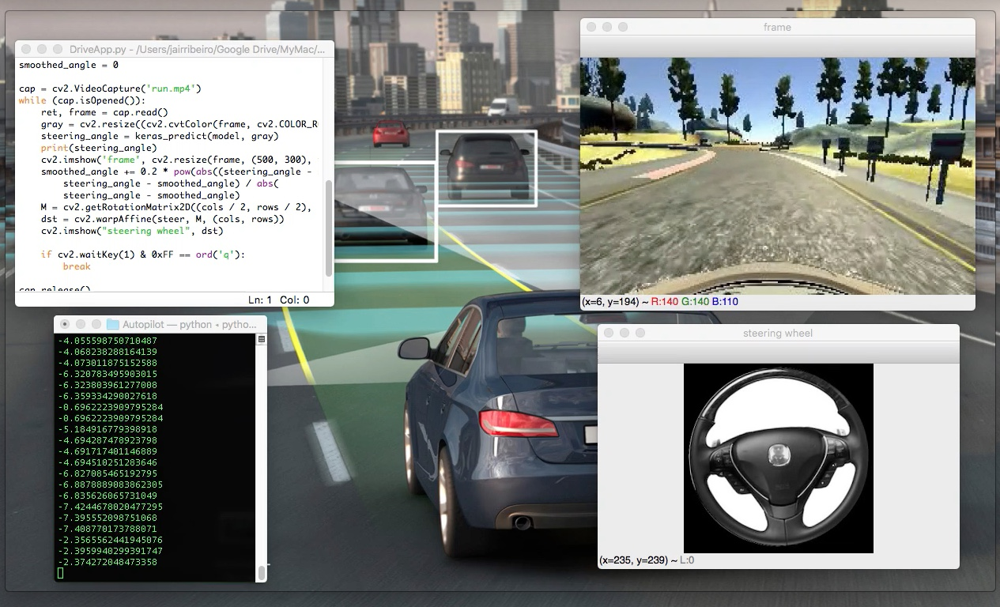
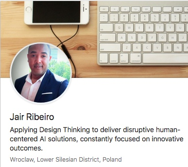

## Basic_Self_driving_car
This code helps in getting the steering angle of self driving car. 

  

How Does a Self-Driving Car Work?

Car manufacturers have been working on self-driving cars since around 2008 and claim that they will be available on the roads as early as 2020. Google has said it will have a self-driving car option by 2018. The self-driving car employs many available technologies which allow an automobile to move safely through the streets without a driver. Sensing its surroundings without any human intervention, the self-driving car would offer a whole new approach to commuting on the roadways.

The technical components of a self-driving car

Each car is equipped with an inertial navigation system, GPS, radar, video, and laser rangefinders. The vehicle leverages information gleaned from the inertial navigation system — a device that accumulates errors over time — and the GPS to determine where it is located and then uses the sensor data to further refine its position. From these data inputs, the car builds a three-dimensional image of where it is located.

The car uses the noise filtered data from the sensors to make navigation decisions through its control system.

A self-driving car is designed using a deliberative architecture, meaning that it’s able to make intelligent decisions by storing a map of its environment. From that stored map, the self-driving car makes decisions on the best way to navigate around obstacles, such as pedestrians and road work.

After the vehicle has made routing decisions, a variety of commands are then sent to the car’s actuators which control the braking, throttle, and steering. All of these processes are repeated many times per second until the car comes to its final destination.

The inspiration is taken from [Udacity Self driving car](https://github.com/udacity/CarND-Behavioral-Cloning-P3) module as well [End to End Learning for Self-Driving Cars](https://devblogs.nvidia.com/deep-learning-self-driving-cars/) module from NVIDIA
[Autopilot Version 2](https://github.com/akshaybahadur21/Autopilot/tree/master/Autopilot_V2)

The End to End Learning for Self-Driving Cars research paper can be found at (https://arxiv.org/abs/1604.07316)
This repository uses convnets to predict steering angle according to the road.

### Code Requirements
You can install Conda for python which resolves all the dependencies for machine learning.

##### pip install requirements.txt

### Description
An autonomous car (also known as a driverless car, self-driving car, and robotic car) is a vehicle that is capable of sensing its environment and navigating without human input. Autonomous cars combine a variety of techniques to perceive their surroundings, including radar, laser light, GPS, odometry, and computer vision. Advanced control systems interpret sensory information to identify appropriate navigation paths, as well as obstacles and relevant signage

## Autopilot V1 (Udacity Dataset based on Udacity Simulator)

### Dataset
You can get the dataset at [here](https://d17h27t6h515a5.cloudfront.net/topher/2016/December/584f6edd_data/data.zip)

### Python  Implementation

1. Network Used- Convolutional Network
2. Inspiration - Udacity SDC and End to End Learning for Self-Driving Cars by Nvidia

If you face any problem, kindly raise an issue

### Procedure

1. First, run `LoadData.py` which will get dataset from folder and store it in a pickle file.
2. Now you need to have the data, run `TrainModel.py` which will load data from pickle and augment it. After this, the training process begins.
3. For testing it on the video, run `DriveApp.py`

## Autopilot V2 (NVIDIA Dataset based on real world)

### Dataset
Approximately 63,000 images, 3.1GB. Data was recorded around Rancho Palos Verdes and San Pedro California.
Data format is as follows: filename.jpg angle,year-mm-dd hr:min:sec:millisec
Download the dataset at [here](https://github.com/SullyChen/driving-datasets) and extract into the repository folder

### Python  Implementation

1. Network Used- Convolutional Network
2. Inspiration - End to End Learning for Self-Driving Cars by Nvidia

If you face any problem, kindly raise an issue

### Procedure

1. First, run `LoadData_V2.py` which will get dataset from folder and store it in a pickle file after preprocessing.
2. Now you need to have the data, run `Train_pilot.py` which will load data from pickle. After this, the training process begins.
3. For testing it on the video, run `AutopilotApp_V2.py`

### References:
* Mariusz Bojarski, Davide Del Testa, Daniel Dworakowski, Bernhard Firner, Beat Flepp, Prasoon Goyal, Lawrence D. Jackel, Mathew Monfort, Urs Muller, Jiakai Zhang, Xin Zhang, Jake Zhao, Karol Zieba. [End to End Learning for Self-Driving Cars](https://arxiv.org/abs/1604.07316)
* [Behavioral Cloning Project](https://github.com/udacity/CarND-Behavioral-Cloning-P3)
* This implementation also took a lot of inspiration from the Sully Chen github repository: https://github.com/SullyChen/Autopilot-TensorFlow and it’s forked from the [GitHub - akshaybahadur21/Autopilot: A self driving car model for humans.](https://github.com/akshaybahadur21/Autopilot)
*How Does a Self-Driving Car Work? By Chris Pichereau, Abshier House [https://www.dummies.com/consumer-electronics/how-does-a-self-driving-car-work/]

Jair Ribeiro 
 
  
 
https://www.linkedin.com/in/jairribeiro/
